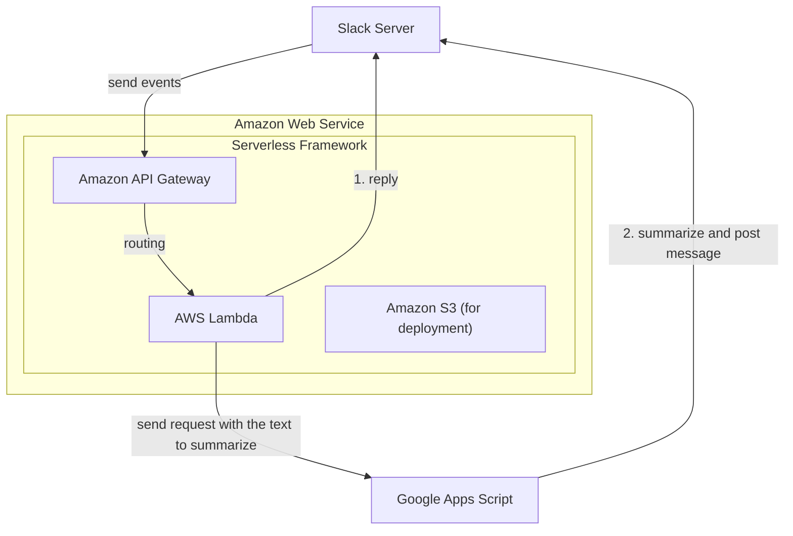

# Slack Meeting Summary Bot



# Setup
## Google Apps Script

## .env
```.env
SLACK_BOT_TOKEN=<xoxb-...>
SLACK_SIGNING_SECRET=<Your Secret>
GAS_API_URL=https://script.google.com/macros/s/<Script ID>/exec
```

# Deploy
Deployed on AWS Lambda using Serverless Framework.
Ensure Node.js version be higher than 18.
