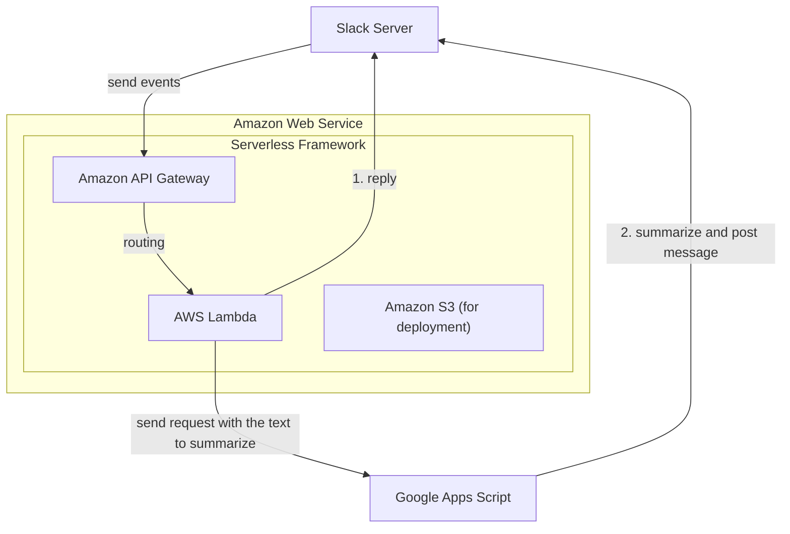

# Slack Meeting Summary Bot



# Setup
## Google Apps Script

## .env
```.env
SLACK_BOT_TOKEN=<xoxb-...>
SLACK_SIGNING_SECRET=<Your Secret>
GAS_API_URL=https://script.google.com/macros/s/<Script ID>/exec
```

# Deploy
Deployed on AWS Lambda using Serverless Framework.
Ensure Node.js version be higher than 18.

# Usage
## Line Clova Note
- Line Clova Noteで録音・文字起こし
- 文字起こしを修正
  - 参加者名の入力など
- 右上のメニューから「音声記録のダウンロード」
- Slackで共有。アプリをインストールしたチャンネルに投稿

|  |  |
|:-:|:-:|
|||


- しばらくすると要約が送信されます。
